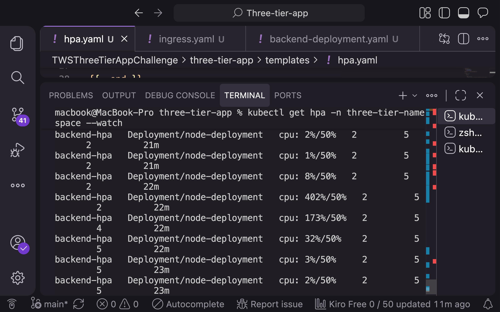
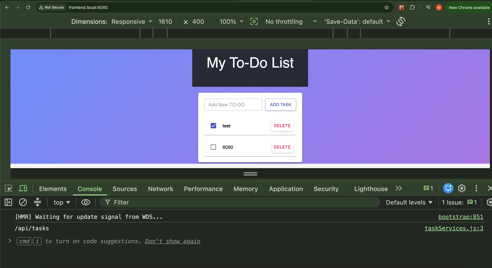

# 🚀 Three-Tier Application on Kubernetes with Helm

A production-ready three-tier application deployed on Kubernetes using **Helm**. This project demonstrates modern DevOps practices including containerization, Kubernetes orchestration, Ingress routing, health checks, autoscaling, and monitoring.

---

# 📖 Overview

This project deploys a complete three-tier application consisting of:

* **Frontend:** React
* **Backend:** Node.js + Express
* **Database:** MongoDB

The application is fully containerized with Docker and deployed on Kubernetes using Helm. It also includes monitoring with Prometheus and Grafana, automatic scaling using the Horizontal Pod Autoscaler (HPA), and traffic routing through the NGINX Ingress Controller.

---

# 🏗 Architecture

```
                    User
                      │
                      ▼
              NGINX Ingress Controller
                      │
         ┌────────────┴────────────┐
         ▼                         ▼
  Frontend Service           Backend Service
      (React)               (Node.js/Express)
                                      │
                                      ▼
                            MongoDB StatefulSet
                                      │
                           Persistent Volume (PVC)
```

---

# 🚀 Features

## Docker

* Dockerized React frontend
* Dockerized Node.js backend
* Dockerized MongoDB

---

## Kubernetes

* Namespace
* Deployments
* StatefulSet
* Services
* Secrets
* Persistent Volumes
* Persistent Volume Claims
* Resource Requests & Limits
* Liveness Probe
* Readiness Probe

---

## Helm

* Reusable Helm Chart
* Configurable values through `values.yaml`
* Easy deployment and upgrades

---

## Networking

* NGINX Ingress Controller
* Path-based routing
* Internal ClusterIP services

---

## Autoscaling

* Horizontal Pod Autoscaler (HPA)
* CPU-based scaling
* Configurable minimum and maximum replicas

---

## Monitoring

* Prometheus
* Grafana
* Kubernetes metrics
* Pod CPU usage
* Pod Memory usage

---

# 🛠 Tech Stack

| Technology    | Purpose                 |
| ------------- | ----------------------- |
| Docker        | Containerization        |
| Kubernetes    | Container Orchestration |
| Helm          | Package Management      |
| NGINX Ingress | Traffic Routing         |
| React         | Frontend                |
| Node.js       | Backend                 |
| Express       | REST API                |
| MongoDB       | Database                |
| Prometheus    | Monitoring              |
| Grafana       | Dashboards              |

---

# 📂 Project Structure

```
three-tier-app/
│
├── backend/
│
├── frontend/
│
├── helm/
│   ├── Chart.yaml
│   ├── values.yaml
│   └── templates/
│       ├── backend-deployment.yaml
│       ├── backend-service.yaml
│       ├── frontend-deployment.yaml
│       ├── frontend-service.yaml
│       ├── mongodb-statefulset.yaml
│       ├── service.yaml
│       ├── secrets.yaml
│       ├── ingress.yaml
│       └── hpa.yaml
│
└── README.md
```

---

# 📋 Prerequisites

Install the following:

* Docker
* Kind (or Minikube)
* kubectl
* Helm
* Git

---

# ⚙️ Create Kubernetes Cluster

```bash
kind create cluster --name three-tier-cluster
```

Verify the cluster:

```bash
kubectl get nodes
```

---

# 📦 Deploy the Application

Install the Helm chart:

```bash
helm install three-tier-app . -n three-tier-namespace --create-namespace
```

Upgrade after changes:

```bash
helm upgrade three-tier-app . -n three-tier-namespace
```

Uninstall:

```bash
helm uninstall three-tier-app -n three-tier-namespace
```

---

# 🌐 Install NGINX Ingress Controller

Add the Helm repository:

```bash
helm repo add ingress-nginx https://kubernetes.github.io/ingress-nginx
```

Update repositories:

```bash
helm repo update
```

Install:

```bash
helm install ingress-nginx ingress-nginx/ingress-nginx \
  --namespace ingress-nginx \
  --create-namespace
```

Port-forward:

```bash
kubectl port-forward -n ingress-nginx service/ingress-nginx-controller 8080:80
```

Update `/etc/hosts`:

```
127.0.0.1 frontend.local
```

Visit:

```
http://frontend.local:8080
```

---

# ❤️ Health Checks

The backend uses:

* Liveness Probe
* Readiness Probe

Health endpoint:

```
GET /ok
```

Verify:

```bash
kubectl describe pod <pod-name>
```

---

# 📈 Horizontal Pod Autoscaler

The backend automatically scales based on CPU utilization.

Configuration:

* Minimum Pods: 2
* Maximum Pods: 5
* Target CPU Utilization: 50%

View HPA:

```bash
kubectl get hpa
```

Watch scaling:

```bash
kubectl get hpa --watch
```

---

# 📊 Install Prometheus

```bash
helm repo add prometheus-community https://prometheus-community.github.io/helm-charts

helm repo update

helm install prometheus prometheus-community/prometheus \
  --namespace monitoring \
  --create-namespace
```

Port-forward:

```bash
kubectl port-forward svc/prometheus-server 9090:80 -n monitoring
```

Open:

```
http://localhost:9090
```

---

# 📉 Install Grafana

```bash
helm repo add grafana https://grafana.github.io/helm-charts

helm repo update

helm install grafana grafana/grafana \
  --namespace monitoring
```

Port-forward:

```bash
kubectl port-forward svc/grafana 3000:80 -n monitoring
```

Open:

```
http://localhost:3000
```

Get the username:

```bash
kubectl get secret grafana -n monitoring \
-o jsonpath="{.data.admin-user}" | base64 --decode
```

Get the password:

```bash
kubectl get secret grafana -n monitoring \
-o jsonpath="{.data.admin-password}" | base64 --decode
```

---

# 🔍 Useful Commands

View Pods:

```bash
kubectl get pods -n three-tier-namespace
```

View Services:

```bash
kubectl get svc -n three-tier-namespace
```

View Ingress:

```bash
kubectl get ingress -n three-tier-namespace
```

View Logs:

```bash
kubectl logs <pod-name> -n three-tier-namespace
```

Describe Pod:

```bash
kubectl describe pod <pod-name> -n three-tier-namespace
```

View HPA:

```bash
kubectl get hpa -n three-tier-namespace
```

View Resource Usage:

```bash
kubectl top pods -n three-tier-namespace
```

---

# 📸 Screenshots

## Horizontal Pod Autoscaler



## Frontend.local:8080



---

# 👨‍💻 Author

**Muhammad Noman**

* GitHub: https://github.com/nomandev1011

* LinkedIn: https://linkedin.com/in/maliknoman-devops-cloud
